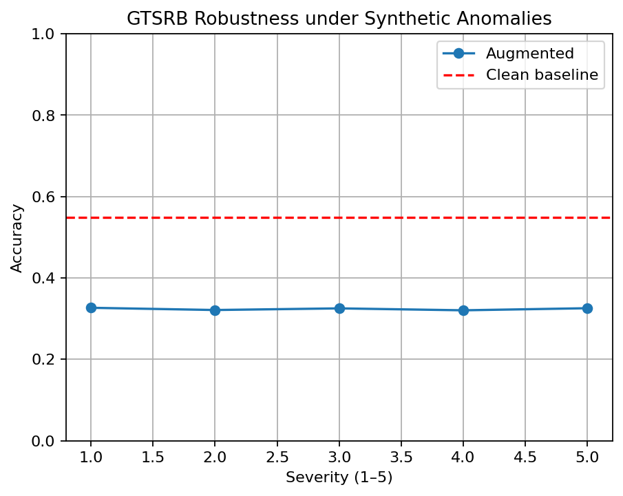

# Vision Transformer Automotive 

> Implemented **Vision Transformers (ViT)** for automotive image classification (traffic signs & car models).  
> Extended to **object detection** with DETR, including **attention visualizations** to highlight discriminative features.  

---

## Features
- **Classification**
  - Traffic sign recognition on **[GTSRB](https://benchmark.ini.rub.de/gtsrb_news.html)**  
  - Car model recognition on **[Stanford Cars](https://www.kaggle.com/datasets/jessicali9530/stanford-cars-dataset)**  
- **Detection**
  - Object detection with **DETR** (COCO-style annotations)  
- **Interpretability**
  - **Attention rollout** heatmaps to visualize where the transformer is “looking”

**ROBUSTNESS TO ADVERSE CONDITIONS** 

Evaluated ViT on GTSRB under synthetic anomalies (fog,rain,blur,brightness,shifts):
| Setting   | Accuracy |
|-----------|----------|
| Clean     | 0.548    |
| Augmented | 0.326    |
| Δ (drop)  | −0.223   |

We also sweep augmentation **severity (1–5)**:

  

*Augmentations implemented with Albumentations; images are kept uint8 and then normalized by the HF processor.*
